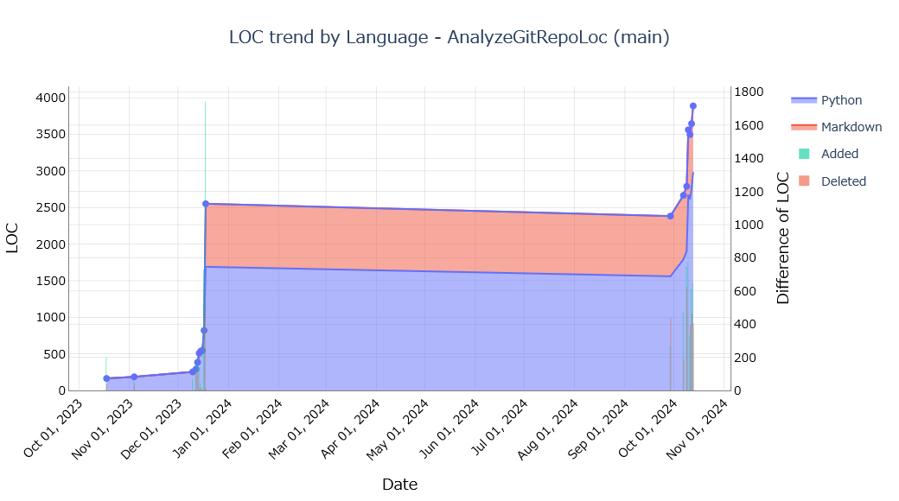

# AnalyzeGitRepoLOC

## Overview

Analyze Git repositories and visualize code LOC.



## Release Notes

[CHANGELOG](./CHANGELOG.md)

## Requirement

1. Clone to git repository.

    ```shell
    git clone https://github.com/nobShinjo/AnalyzeGitRepoLoc
    ```

1. Creation of virtual environments.

    ```shell
    cd ./AnalyzeGitRepoLoc/
    python -m venv .venv
    python -m pip install --upgrade pip
    pip install -r requirements.txt
    ```

    If you prefer to use `pip-tools`, you can use the following commands:

    ```shell
    cd ./AnalyzeGitRepoLoc/
    python -m venv .venv
    python -m pip install --upgrade pip
    pip-sync --python-executable .venv/Scripts/python.exe
    ```

## Usage

### Example : Monthly Analysis

  ```shell
  python -m analyze_git_repo_loc [repository_path] --interval monthly -o ./out 
  ```

### Example : Daily Analysis

  ```shell
  python -m analyze_git_repo_loc [repository_path] --interval daily -o ./out 
  ```

### Example : Specify branch name

  ```shell
  python -m analyze_git_repo_loc [repository_path] -b develop --interval daily -o ./out 
  ```

### Example : Filter by date

  ```shell
  python -m analyze_git_repo_loc [repository_path] --interval monthly -o ./out --since 2023-01-01 --until 2023-12-31
  ```

### Example : Filter by Language

  ```shell
  python -m analyze_git_repo_loc [repository_path] --interval monthly -o ./out --lang C#,Python,text,Markdown
  ```

### Example : Filter by Author

  ```shell
  python -m analyze_git_repo_loc [repository_path] --interval monthly -o ./out --author-name [author name] 
  ```

### Example : Exclude directory

  ```shell
  python -m analyze_git_repo_loc [repository_path] --interval monthly -o ./out --author-name [author name] --exclude-dirs dir1,dir2
  ```

### Example : Multi repository

  ```shell
  python -m analyze_git_repo_loc [repository_path],[repository_path],[repository_path] --interval monthly -o ./out 
  ```

### Example : Clear old cache files

  ```shell
  python -m analyze_git_repo_loc [repository_path] --interval monthly -o ./out --clear-cache
  ```

### Help

  ```shell
  python -m analyze_git_repo_loc --help
  ```

  ```text
  usage: analyze_git_repo_loc [-h] [-o OUTPUT] [--since SINCE] [--until UNTIL] [--interval {daily,weekly,monthly}] [--lang LANG]
                            [--author-name AUTHOR_NAME] [--exclude-dirs EXCLUDE_DIRS] [--clear-cache] [--no-plot-show]
                            repo_paths

Analyze Git repositories and visualize code LOC.

positional arguments:
  repo_paths            A text file containing a list of repositories, or a comma-separated list of Git repository paths or URLs, optionally followed by   
                        a branch name separated with '#'. Examples: /path/to/repo1#branch-name orhttp://github.com/user/repo2.git#branch-name. If no       
                        branch is specified, 'main' will be used as the default.

options:
  -h, --help            show this help message and exit
  -o OUTPUT, --output OUTPUT
                        Output path
  --since SINCE         Start Date yyyy-mm-dd
  --until UNTIL         End Date yyyy-mm-dd
  --interval {daily,weekly,monthly}
                        Interval (default: monthly)
  --lang LANG           Count only the given space separated, case-insensitive languages L1,L2,L3, etc.
  --author-name AUTHOR_NAME
                        Author name or comma-separated list of author names to filter commits
  --exclude-dirs EXCLUDE_DIRS
                        Exclude directories from analysis, specified as comma-separated paths relative to the repository root.
  --clear-cache         If set, the cache will be cleared before executing the main function.
  --no-plot-show        If set, the plots will not be shown.
  ```

## Author

Nob Shinjo (<https://github.com/nobShinjo>)

## Licenses

- [LICENSE](./LICENSE)
- [3rd Party LicenSes](./3rdPartyLicenses.md)

## Languages

The available languages can be checked by executing the following command.

Please refer to [languages](./LANGUAGES.md) for the available programming languages.

[languages](./LANGUAGES.md)
