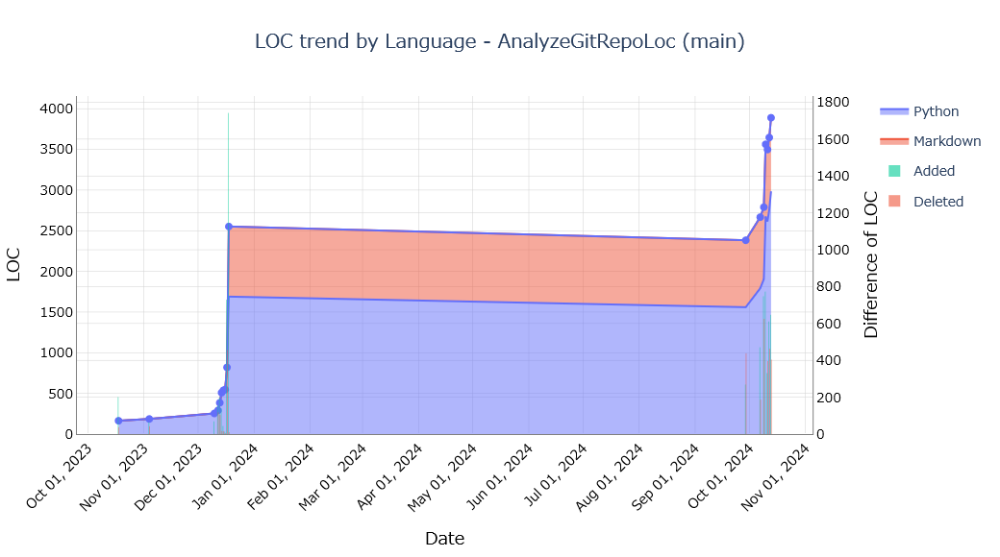

# AnalyzeGitRepoLOC

## Overview

Analyze Git repositories and visualize code LOC.



## Release Notes

[CHANGELOG](./CHANGELOG.md)

## Requirement

1. Clone to git repository.

    ```shell
    git clone https://github.com/nobShinjo/AnalyzeGitRepoLoc
    ```

1. Create a virtual environment and install dependencies with `uv`.

    ```shell
    cd ./AnalyzeGitRepoLoc/
    uv venv --python 3.14
    # Windows PowerShell
    .venv\Scripts\Activate.ps1
    # macOS/Linux
    # source .venv/bin/activate
    uv sync --active
    ```

## Usage

### Command line

```shell
python -m analyze_git_repo_loc [repo_paths] [options]
```

`repo_paths` is a comma-separated list of Git repository paths or URLs.

Each repository entry supports an optional branch name using `#`:
`/path/to/repo#branch-name` or `https://github.com/user/repo.git#branch-name`.
If no branch is specified, `main` is used. When `--config` is provided,
`repo_paths` can be omitted.

Note: Per-repository exclude directories can be specified in the YAML config.
`--exclude-dirs` applies to all repositories.

### Remote authentication

The CLI prefers SSH keys for remote repositories. When SSH access is unavailable
it can fall back to HTTPS token authentication for GitHub or GitLab.

Set one of the following environment variables before running the CLI:

- `GITHUB_TOKEN`: GitHub personal access token for HTTPS authentication.
- `GITLAB_TOKEN`: GitLab personal access token for HTTPS authentication.

### Examples

#### Example : Monthly Analysis

```shell
python -m analyze_git_repo_loc /path/to/repo#main --interval monthly -o ./out
```

#### Example : Daily Analysis

```shell
python -m analyze_git_repo_loc /path/to/repo#main --interval daily -o ./out
```

#### Example : Specify branch name

```shell
python -m analyze_git_repo_loc /path/to/repo#develop --interval daily -o ./out
```

#### Example : Filter by date

```shell
python -m analyze_git_repo_loc /path/to/repo#main --interval monthly -o ./out --since 2023-01-01 --until 2023-12-31
```

#### Example : Filter by Language

```shell
python -m analyze_git_repo_loc /path/to/repo#main --interval monthly -o ./out --lang C#,Python,text,Markdown
```

#### Example : Filter by Author

```shell
python -m analyze_git_repo_loc /path/to/repo#main --interval monthly -o ./out --author-name "Alice,Bob"
```

#### Example : Exclude directory

```shell
python -m analyze_git_repo_loc /path/to/repo#main --interval monthly -o ./out --exclude-dirs dir1,dir2
```

#### Example : Multi repository (comma-separated)

```shell
python -m analyze_git_repo_loc /path/to/repo1#main,/path/to/repo2#develop --interval monthly -o ./out
```

#### Example : YAML config

```shell
python -m analyze_git_repo_loc --config ./config.yml
```

#### Example : GitHub/GitLab repository selector TUI

```shell
python -m analyze_git_repo_loc --tui --config ./config.yml
```

The TUI lists repositories from enabled GitHub/GitLab providers, lets you
search and select multiple repositories, then immediately runs the normal
analysis pipeline with the selected repositories.

When only one provider is configured and `GITHUB_TOKEN` / `GITLAB_TOKEN` or an
existing `gh` / `glab` login is available, `--tui` starts at Quick Review.
Press Enter to run, `e` to edit, `d` for details, `s` to save config then run,
or `c` to cancel.

#### Example : Limit workers

```shell
python -m analyze_git_repo_loc /path/to/repo#main --interval monthly -o ./out --workers 4
```

#### Example : Clear old cache files

```shell
python -m analyze_git_repo_loc /path/to/repo#main --interval monthly -o ./out --clear-cache
```

### YAML configuration

Use `--config` to load a YAML file. CLI arguments override `settings`, and
`repo_paths` on the CLI takes precedence over `repositories`.

```yaml
settings:
  output: ./out
  interval: monthly
  since: 2023-01-01
  until: 2023-12-31
  lang:
    - Python
    - C#
    - Markdown
  author_name: "Alice,Bob"
  exclude_dirs:
    - docs
    - tests
  workers: 4

repositories:
  - path: /path/to/repo1
    branch: main
    exclude_dirs:
      - tools
      - samples
  - path: https://github.com/user/repo2.git
    branch: develop

tui:
  providers:
    github:
      enabled: true
      api_base_url: https://api.github.com
    gitlab:
      enabled: false
      base_url: https://gitlab.com
  defaults:
    clone_protocol: https
  quick_defaults:
    interval: monthly
    cache_policy: use
    no_plot_show: true
    exclude_dirs:
      - node_modules
      - .venv
```

Notes:

- `repositories` entries may be a string (path/URL) or a mapping with `path`,
  `branch`, and `exclude_dirs`. Branch defaults to `main`.
- `lang`, `author_name`, and `exclude_dirs` accept a YAML list or a
  comma-separated string.
- `--tui` requires `--config` and may use a YAML file without `repositories`.
- `--tui` runs a pre-analysis wizard. YAML and CLI values are loaded as
  defaults, then the wizard confirms repository selection, branches, filters,
  path rules, output, cache policy, and display behavior before analysis starts.
- The wizard can ask which providers to use: GitHub, GitLab.com, and
  self-hosted GitLab. If exactly one provider is configured, that provider is
  selected automatically. The self-hosted GitLab URL can be entered at runtime.
- `tui.quick_defaults` stores non-secret defaults used by the Quick Review
  screen. It never stores tokens, client IDs, or authentication choices.
- In the TUI wizard, global excludes and per-repository excludes are combined
  into the repository entries passed to the existing analysis pipeline. Quick
  Review excludes are applied only when the path exists in the cached repo.
- Quick Review starts with a compact summary and uses terminal colors when
  supported to distinguish headings, summary values, actions, and cache states.
  Press `d` to show repository-level details and full execution conditions.
- TUI-selected repositories may include `include_subpath` when saving config;
  the analysis run treats it as a repository-root-relative subpath.
- TUI authentication is selected at runtime. It offers environment tokens
  (`GITHUB_TOKEN` / `GITLAB_TOKEN`), existing `gh` / `glab` CLI login tokens,
  OAuth Device Code login when an application client ID is available, or a
  one-time token entered for the current run.
- Environment tokens and existing `gh` / `glab` logins are selected
  automatically when they are the configured provider's available non-interactive
  option. Device Code and one-time token authentication still require explicit
  selection.
- TUI authentication details are not stored in YAML, files, or keyrings by this
  application. Resolved tokens are mirrored only into the current process
  environment for downstream clone compatibility.
- `tui.defaults.clone_protocol` accepts `https` or `ssh`.

### Output files

The output root is `--output` (default: `./out`). Each run creates a timestamped
directory (`YYYYMMDDHHMMSS`) with run-level outputs, and per-repository folders
are created directly under the output root.

Run directory (timestamped) contents:

- `summary.md`: Markdown summary for the run.
- `repo_list.txt`: Repository and branch list used for the run.
- `language_analysis.csv`, `author_analysis.csv`, `repository_trend_analysis.csv`
- `report.html` and `assets/` (Tabler CSS/JS and Plotly JS).
- Multi-repo only: `repository_chart.html`, `author_chart.html`,
  `author_contribution_contribution_chart.html`, plus corresponding
  `*_trend_data.csv` and `*_summary_data.csv`.

Per-repository directory (under the output root) contents:

- `loc_data.csv`
- `language_trends.csv`, `language_trend_data.csv`,
  `language_summary_data.csv`, `language_chart.html`
- `author_trends.csv`, `author_trend_data.csv`,
  `author_summary_data.csv`, `author_chart.html`

The `.cache` directory under the output root stores remote clones and can be
cleared with `--clear-cache`.

### Stdout examples

Example: stdout while running

```text
# Start analyze_git_repo_loc.
- Analyze Git repositories and visualize code LOC.

Analyzing repositories:  50%|=====     | 1/2 [00:06<00:06,  6.04s/it]

# Analysis of LOC in git repository: AnalyzeGitRepoLoc (main)
Analyzing commits:  42%|====      | 84/200 [00:03<00:04, 28.2commit/s]

# Forming dataframe type data.
Processing loc data:  50%|=====     | 1/2 [00:01<00:01,  1.10s/it]
```

Example: stdout when analysis completes 100%

```text
Analyzing repositories: 100%|==========| 2/2 [00:12<00:00,  6.02s/it]
# Save the analyzed data.
Saving analyzed data: 100%|==========| 3/3 [00:00<00:00, 52.3it/s]
# Generate charts.
Charts: Language trend: 100%|==========| 5/5 [00:02<00:00,  2.31it/s]
# Generate HTML report.
Generating HTML report: 100%|==========| 4/4 [00:01<00:00,  3.52it/s]

# LOC Analyze
                                                  FINISH
```

### Help

```shell
python -m analyze_git_repo_loc --help
```

```text
usage: analyze_git_repo_loc [-h] [--config CONFIG] [-o OUTPUT] [--since SINCE] [--until UNTIL] [--interval {daily,weekly,monthly}] [--lang LANG]
                            [--author-name AUTHOR_NAME] [--exclude-dirs EXCLUDE_DIRS] [--workers WORKERS] [--clear-cache] [--no-plot-show]
                            repo_paths

Analyze Git repositories and visualize code LOC.

positional arguments:
  repo_paths            A comma-separated list of Git repository paths or URLs,
                        optionally followed by a branch name separated with '#'. Examples: /path/to/repo1#branch-name
                        orhttp://github.com/user/repo2.git#branch-name. If no branch is specified, 'main' will be used as the default.
                        Use --config for multi-repository YAML inputs.

options:
  -h, --help            show this help message and exit
  --config CONFIG       YAML configuration file path
  -o, --output OUTPUT   Output path
  --since SINCE         Start Date yyyy-mm-dd
  --until UNTIL         End Date yyyy-mm-dd
  --interval {daily,weekly,monthly}
                        Interval (default: monthly)
  --lang LANG           Count only the given space separated, case-insensitive languages L1,L2,L3, etc.
  --author-name AUTHOR_NAME
                        Author name or comma-separated list of author names to filter commits
  --exclude-dirs EXCLUDE_DIRS
                        Exclude directories from analysis, specified as comma-separated paths relative to the repository root.
  --workers WORKERS     Maximum number of repositories to analyze concurrently (default: auto).
  --clear-cache         If set, the cache will be cleared before executing the main function.
  --no-plot-show        If set, the plots will not be shown.
```

## Author

Nob Shinjo (<https://github.com/nobShinjo>)

## Licenses

- [LICENSE](./LICENSE)
- [3rd Party LicenSes](./3rdPartyLicenses.md)

## Languages

The available languages can be checked by executing the following command.

Please refer to [languages](./LANGUAGES.md) for the available programming languages.

[languages](./LANGUAGES.md)
