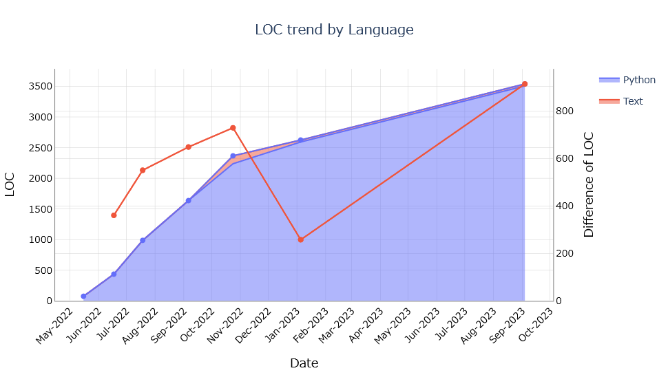

# AnalyzeGitRepoLOC

## Overview

Analyze Git repositories and visualize code LOC.



## Requirement

1. Clone to git repository.

    ```shell
    git clone https://github.com/nobShinjo/AnalyzeGitRepoLoc
    ```

1. Creation of virtual environments.

    ```shell
    cd ./AnalyzeGitRepoLoc/
    python -m venv .venv
    python -m pip install --upgrade pip
    pip install -r requirements.txt
    ```

1. Install CLOC.

   - [Official Github project page](https://github.com/AlDanial/cloc)
   - [How to install cloc](https://github.com/AlDanial/cloc#install-via-package-manager)

## Usage

### Example : Monthly Analysis

  ```shell
  python .\analyze_git_repo_loc.py [repository_path] --interval monthly -o ./out 
  ```

### Example : Daily Analysis

  ```shell
  python .\analyze_git_repo_loc.py [repository_path] --interval daily -o ./out 
  ```

### Example : Specify branch name

  ```shell
  python .\analyze_git_repo_loc.py [repository_path] -b develop --interval daily -o ./out 
  ```

### Example : Filter by date

  ```shell
  python .\analyze_git_repo_loc.py [repository_path] --interval monthly -o ./out -s 2023-01-01 -e 2023-12-31
  ```

### Example : Filter by Language

  ```shell
  python .\analyze_git_repo_loc.py [repository_path] --interval monthly -o ./out --lang C#,Python,text,Markdown
  ```

### Example : Clear old cache files

  ```shell
  python .\analyze_git_repo_loc.py [repository_path] --interval monthly -o ./out --clear_cache
  ```

### Help

  ```shell
  python .\analyze_git_repo_loc.py --help
  ```

  ```text
  usage: analyze_git_repo_loc [-h] [-o OUTPUT] [-s START_DATE] [-e END_DATE] [-b BRANCH]
                              [--interval {daily,weekly,monthly}] [--lang LANG] [--clear_cache]
                              repo_path

  Analyze Git repositories and visualize code LOC.

  positional arguments:
    repo_path             Path of Git repository

  options:
    -h, --help            show this help message and exit
    -o OUTPUT, --output OUTPUT
                          Output path
    -s START_DATE, --start_date START_DATE
                          Start Date yyyy-mm-dd
    -e END_DATE, --end_date END_DATE
                          End Date yyyy-mm-dd
    -b BRANCH, --branch BRANCH
                          Branch name (default: main)
    --interval {daily,weekly,monthly}
                          Interval (default: monthly)
    --lang LANG           Count only the given space separated, case-insensitive languages L1,L2,L3, etc. Use 'cloc
                          --show-lang' to see the list of recognized languages.
    --clear_cache         If set, the cache will be cleared before executing the main function.
  ```

## Author

Nob Shinjo (<https://github.com/nobShinjo>)

## Licenses

- [LICENSE](./LICENSE)
- [3rd Party LicenSes](./3rdPartyLicenses.md)

## Languages

The available languages can be checked by executing the following command.

```shell
cloc --show-lang
```

[languages](./LANGUAGES.md)
